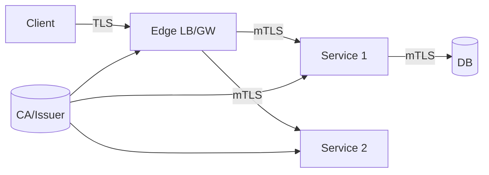

# Transport Security: TLS and mTLS

## Overview
TLS protects data in transit; mutual TLS (mTLS) authenticates both client and server, enabling per‑service identity and authorization. Decide where to terminate, when to re‑encrypt, and how to rotate certificates safely.

## What, Why, When (and when‑not)
What
- TLS 1.2+/1.3, HSTS, strong ciphers; mTLS with SPIFFE IDs in meshes or via service certs.

Why
- Prevents interception/tampering and provides cryptographic identity inside the perimeter.

When
- Always for public traffic; mTLS for east‑west in zero‑trust or regulated environments.

When‑not
- Rarely optional; for internal lab networks, you may defer mTLS but document risk.

## Core concepts and variants
- Termination: edge LB/API GW offloads TLS; re‑encrypt to services or use mesh sidecars for mTLS.
- Certificates: ACME/Let’s Encrypt for public; internal CA for service identities; automate rotation.
- Cipher suites: prefer AEAD (AES‑GCM/ChaCha20‑Poly1305); disable legacy/weak suites and TLS 1.0/1.1.

## Design decisions and trade‑offs
- Central termination vs end‑to‑end: central simplifies ops but exposes internal hops; re‑encrypt to protect internal links at small CPU cost.
- Mesh vs library TLS: mesh simplifies policy/rotation; library avoids sidecar overhead but increases app complexity.

## Architecture and components
- Edge terminators (CDN/LB/GW), mesh/sidecars or service libraries, internal CA/issuers, and cert managers.

Mermaid: TLS termination and mTLS

## Operational considerations
- Rotation: automate issuance (ACME/CSR), renew before expiry; alert on certs `<7` days validity.
- Performance: enable TLS session resumption and HTTP/2; prefer ECDSA certs where supported.
- Pinning: avoid strict pinning; use pinning with care (breakage risk) and rely on standard validation.

## Examples
Example A (quantitative): CPU overhead
- Modern TLS adds ~1–3% CPU at scale with session resumption and HTTP/2. Budget accordingly; terminate early to reduce per‑service cost or use mesh acceleration.

Example B (architectural): Zero‑trust east‑west
- Mesh issues SPIFFE IDs, enforces mTLS for all inter‑service traffic, and authorizes by SPIFFE + policy (OPA). Edge terminates TLS from internet and re‑encrypts to mesh ingress.

## Edge cases and anti‑patterns
- Allowing TLS 1.0/1.1 or weak ciphers; enforce minimum versions org‑wide.
- Manual certs and one‑off scripts; use cert‑manager/ACME flows.

## Interactions with adjacent topics
- [Identity](./02-identity-oauth2-oidc.md) for service identities; [Edge Security](./08-edge-security-waf-rate-limits-bot-detection.md) for perimeter policies.

## Production checklist
- Enforce TLS 1.2+/1.3, HSTS, strong ciphers; automate cert issuance/rotation; monitor expiry.
- Use mTLS for east‑west in meshes or high‑risk environments; authorize by SPIFFE ID/policy.

## Interview framing checklist
- How do you roll mTLS across 200 services without downtime?
- Where do you terminate TLS and why? When do you re‑encrypt?

## References
- RFC 8446 (TLS 1.3), SPIFFE/SPIRE, cert‑manager/ACME docs
