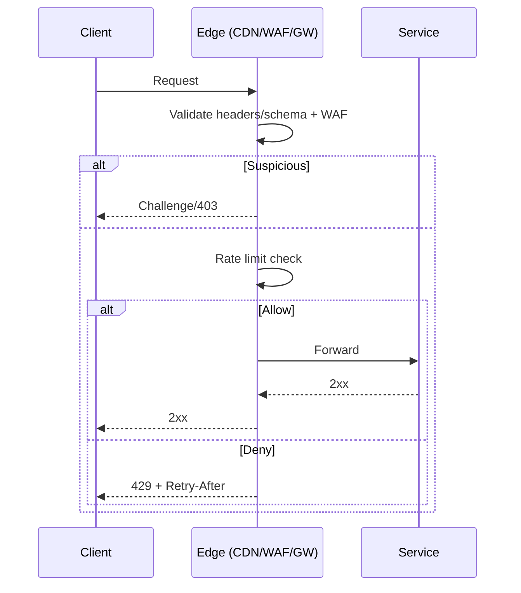

# Edge Security: WAF, Rate Limits, Bot Detection

## Overview
The edge is the first and often most cost‑effective control point. Block obvious abuse, enforce schemas and sizes early, and apply rate limits/quotas close to the client.

## What, Why, When (and when‑not)
What
- WAF signatures/anomaly detection, header/schema validation, bot defenses (reputation, challenges), and per‑tenant limits.

Why
- Reduces waste on downstream services, protects SLOs, and limits exploit surface.

When
- Public internet exposure, partner integrations, or any API with significant blast radius.

When‑not
- Do not rely solely on WAFs; combine with service‑level validation and authz.

## Core concepts and variants
- Positive validation: JSON schema checks, size limits, method/verb whitelists.
- Bot defense: IP/device reputation, behavioral signals, proof‑of‑work/challenges for suspicious traffic.
- Rate limiting and backpressure: per tenant, per endpoint; hard vs soft responses with Retry‑After.

## Architecture and components
- CDN/WAF, API gateway, bot mitigation services, and limiter backends (Redis/Datastore) with health fallbacks.

Mermaid: edge request flow

## Operational considerations
- False positives: stage new rules in count‑only mode; alert before enforce.
- Observability: per‑rule hit counts, deny reasons, and top offenders by tenant/source.
- Incident playbooks: raise challenges/friction during attacks; temporarily tighten limits.

## Examples
Example A (quantitative): Rate limits sizing at edge
- With 1,000 tenants and average 5 rps each, set default 20 rps + 40 burst per tenant at edge. Global cap 50k rps. Expect ~2% 429 under peak; adjust per tier.

Example B (architectural): Credential stuffing defense
- Combine reputation (IP/ASN), velocity per account/email domain, and risk‑based challenges (WebAuthn prompt/MFA). Throttle login attempts and add progressive delays; coordinate with identity telemetry for detections.

## Edge cases and anti‑patterns
- Only signature‑based WAF rules; add positive validation and allow‑lists.
- Per‑IP limits only; use tenant/account scopes to avoid NAT collisions.

## Interactions with adjacent topics
- [Rate Limiting & Backpressure](../08-rate-limiting-and-backpressure/README.md) for algorithms and runbooks.
- [Identity](./02-identity-oauth2-oidc.md) for login telemetry and challenges.

## Production checklist
- Enforce positive validation and WAF; deploy limits with safe fallbacks.
- Monitor deny/challenge rates; maintain runbooks for attack spikes.

## Interview framing checklist
- How do you tune edge controls to minimize false positives while stopping abuse?
- What scopes do you use for fair rate limiting in a multi‑tenant API?

## References
- OWASP API Security Top 10, CDN/WAF vendor docs, RFC 6585/9110 (429, Retry‑After)
