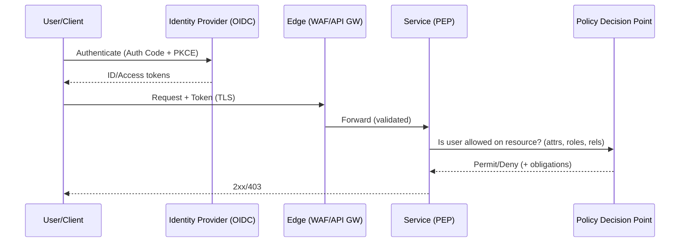

# Security & Auth

## Overview
Security for distributed systems spans people, process, and technology. At the system-design layer, you will model threats, establish identity and transport trust, authorize access with least privilege, protect data across its lifecycle, and operate the system with auditable controls and rapid incident response. This section provides production‑ready patterns, trade‑offs, and checklists.

## What, Why, When (and when‑not)
What
- Identity and transport trust: authenticate principals (users, services, machines), protect channels with TLS/mTLS, and propagate identity across boundaries.
- Authorization: make least‑privilege, auditable decisions using RBAC/ABAC/ReBAC and consistent enforcement points.
- Data protection: minimize, classify, encrypt, tokenize, and retain data appropriately; manage secrets and keys safely.
- Edge controls: validate and filter traffic at the perimeter (WAF, bot defense, rate limits) and at internal choke points.

Why
- Reduce blast radius, prevent common attacks, comply with regulatory requirements, and preserve customer trust while enabling safe velocity for engineering teams.

When
- Always—security is a cross‑cutting concern. Depth varies by risk: public internet exposure, multitenancy, regulated data, or high‑value assets require stronger controls.

When‑not
- Avoid heavyweight controls that do not mitigate realistic risks for your context (e.g., over‑encrypting non‑sensitive telemetry at high cost). Prefer proportionate, layered defenses.

## Core concepts and variants
- CIA vs AAA: confidentiality, integrity, availability; authentication, authorization, accounting (audit).
- Threat modeling: STRIDE/PASTA, trust boundaries, assets, attack surfaces, mitigations, and residual risk.
- Identity: OAuth 2.1/OIDC, human vs service principals, PKCE, device flow, client credentials, service accounts, SPIFFE IDs.
- Tokens & sessions: JWT vs opaque, refresh/rotation, revocation, cookie attributes, JWKS key rotation.
- Authorization: RBAC/ABAC/ReBAC, policy engines (OPA), PDP/PEP architecture, scopes and resource‑centric permissions.
- Secrets & keys: secret storage, distribution, rotation; envelope encryption, KMS vs HSM.
- Transport: TLS versions/ciphers, TLS termination vs re‑encryption, mTLS for east‑west, certificate issuance/rotation.
- Edge: WAF signatures, schema validation, bot detection, DDoS protections, rate limiting and backpressure.
- Data lifecycle: classification, collection minimization, retention, encryption at rest/field‑level, tokenization/pseudonymization.

## Architecture and components
- Identity Provider (IdP): issues tokens (OIDC/OAuth) and publishes JWKS for verification.
- Policy decision/enforcement: gateway filters, service middleware, sidecars/mesh, and centralized PDP caches.
- Key & secret management: KMS/HSM, secret stores (Vault/Cloud Secrets), envelope encryption libraries.
- Observability & audit: structured security logs, SIEM pipeline, alerting and forensics.

Mermaid: high‑level request and authZ flow

## Subpages and deep dives
- [Foundations and Threat Modeling](./01-foundations-and-threat-modeling.md)
- [Identity: OAuth 2.1 and OpenID Connect](./02-identity-oauth2-oidc.md)
- [Tokens and Session Management](./03-tokens-and-session-management.md)
- [Authorization Models: RBAC, ABAC, ReBAC](./04-authorization-models-rbac-abac-rebac.md)
- [Multitenancy and Least Privilege](./05-multi-tenancy-and-least-privilege.md)
- [Secrets Management, KMS, and HSM](./06-secrets-management-kms-hsm.md)
- [Transport Security: TLS and mTLS](./07-transport-security-tls-mtls.md)
- [Edge Security: WAF, Rate Limits, Bot Detection](./08-edge-security-waf-rate-limits-bot-detection.md)
- [Data Protection: PII and Privacy](./09-data-protection-pii-and-privacy.md)
- [Operations, Observability, and Runbooks](./10-operations-observability-and-runbooks.md)
- [Selection Guide and Comparisons](./11-selection-guide-and-comparisons.md)
- [Security & Auth Case Studies](./12-case-studies.md)

## Interactions with adjacent topics
- [Networking & Protocols → TLS](../10-networking-and-protocols/03-tls-and-transport-fundamentals.md)
- [Rate Limiting & Backpressure](../08-rate-limiting-and-backpressure/README.md)
- [Availability & Fault Tolerance](../09-availability-and-fault-tolerance/README.md)
- [IDs & Time](../13-ids-and-time/README.md) for non‑guessable IDs and timestamp trust.

## Production checklist
- Establish an IdP and standardize OAuth2.1/OIDC flows per client type (web, mobile, CLI, service).
- Choose token format and rotation strategy; define logout/revocation and key rotation (JWKS) processes.
- Define authorization model (RBAC/ABAC/ReBAC) and PDP/PEP locations with caching.
- Classify data; encrypt at rest; tokenize sensitive fields; restrict who can decrypt.
- Protect edges with TLS 1.2+/mTLS (east‑west), WAF, schema/header validation, and rate limits.
- Centralize secrets with KMS‑backed storage and rotate on a schedule and on demand.
- Emit structured security/audit logs; feed SIEM with detections and playbooks; run incident game days.

## Interview framing checklist
- How do you pick OAuth/OIDC flows for SPA vs native mobile vs server‑side apps?
- JWT vs opaque tokens—trade‑offs, revocation, and key rotation?
- RBAC vs ABAC vs ReBAC—when to choose each and how to scale policy evaluation?
- mTLS in service meshes—where to terminate and how to rotate certs safely?
- Secrets distribution without secret‑zero and with KMS latency constraints?

## References
- OAuth 2.1 draft, RFC 6749/6750, OIDC Core 1.0
- NIST SP 800‑63 (Digital Identity), SP 800‑57 (Key Management)
- OWASP ASVS, Top 10, Cheat Sheets (Auth, Session Mgmt, Cryptography, API Security)
- Google BeyondCorp (Zero Trust), SPIFFE/SPIRE specs
