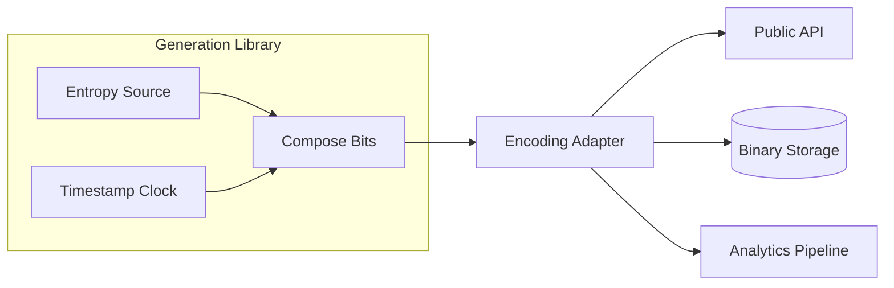

## Overview
Identifier formats range from binary UUIDs to human-friendly ULIDs. The format you expose determines entropy, ordering, storage cost, and leakage risk. Choosing the right type lets systems stay collision-safe while balancing readability and analytics needs.

## What, Why, When (and when-not)
What
- Survey of ID families (UUID variants, ULID/KSUID/XID, Snowflake derivatives) and common encodings (hex, Base32, Base58, Crockford).

Why
- Different workloads need different guarantees: collision probability, sortability, debuggability, and brevity. Encodings influence index width, network payloads, and analyst ergonomics.

When
- When designing APIs, storage schemas, or log pipelines that expose or persist identifiers. Use when migrating legacy IDs or unifying formats across services.

When-not
- Simple prototypes or single-node systems where auto-increment suffices and format migration adds no value.

## Core concepts and variants
- **UUID family (RFC 4122)**: 128-bit binary; variants v1 (timestamp + MAC), v3/v5 (namespace hash), v4 (random), v7 (time-ordered + randomness). Hex string (36 chars) is common but binary storage halves footprint.
- **ULID**: 128-bit, 48-bit millisecond timestamp + 80 bits randomness, Crockford Base32 (26 chars) for lexicographic ordering, good for logs and S3 keys.
- **KSUID**: 160-bit, 32-bit second timestamp + 128-bit payload, Base62 (27 chars); more randomness for sharding, suitable for distributed logs.
- **XID/Monotonic ULID**: extend ULID with monotonic counter or include machine IDs; reduce collision risk under high per-ms throughput.
- **Snowflake derivatives**: 64-bit composite (timestamp + region + worker + sequence); dense and sortable, usually Base10/Base62 encoded.
- **Encodings**: Hex (nibble-aligned, verbose), Base32 (case-insensitive), Base36 (alphanumeric, easy to type), Base58/Base62 (compact, skip ambiguous chars), Base64 (dense but not URL-friendly without tweaks).

## Design decisions and trade-offs
- **Bit length & entropy**: More bits lower collision risk but increase index size; 64-bit IDs fit well in SQL bigint, while 128-bit IDs expand B-tree height.
- **Ordering semantics**: Time-ordered IDs simplify range scans but risk hotspots without hashed suffixes; pure random IDs balance shards but lose temporal grouping.
- **Human factors**: Base58/32 avoid ambiguous characters; hex is easier for tooling; consider case sensitivity and copy/paste safety.
- **Privacy**: Timestamp or MAC bits can leak creation time or machine identity; mask or randomize when exposure is sensitive.
- **Binary vs text storage**: Store as binary for efficiency and convert at edges; textual storage wastes space and cache lines.

## Algorithms/policies (conceptual)
- **UUIDv4 generation**: call cryptographic RNG for 16 bytes, set version/variant bits, emit binary/hex.
- **ULID generation**: combine `timestamp_ms << 80 | randomness`; for monotonic ULID, increment randomness when same ms hits.
- **Base encoding policy**: decide canonical text form (e.g., uppercase Base32) and enforce via validators to prevent mixed formats in logs.

## Architecture and components
- ID libraries exposed as shared packages ensuring consistent generation and encoding.
- Edge/API gateways validate incoming ID strings and convert to binary before database writes.
- Observability pipelines include decoding utilities to enrich logs without storing raw binary in analytics stores.

## Operational considerations
- Monitor collision rates and generation latency per library version; log entropy metrics (e.g., `%` low-order duplicates).
- Track index bloat: compare page splits between binary vs text columns.
- Validate that services agree on canonical encoding to avoid double-encoding or parsing failures.

## Examples
Example A (quantitative): Index height impact
- In PostgreSQL, a 16-byte binary UUID stored in a primary key yields ~60% more rows per page than a 36-byte text UUID. For 200M rows, binary saves ~14 GB storage and reduces cache misses.

Example B (architectural): Multi-tenant SaaS IDs
- Public API exposes ULIDs for readability; ingestion service converts to 16-byte binary before writing to Aurora. Analytics pipeline attaches decoded timestamp to help partition usage dashboards without leaking worker IDs.

## Edge cases and anti-patterns
- Mixing multiple encodings (hex vs Base32) for same entity leads to double entries; enforce single canonical form.
- Exposing sequential Snowflake IDs without hashing can leak write volume patterns; use hash-prefix when publishing externally.
- Relying on Base64 without URL-safe variant causes escaping bugs in REST paths.

## Interactions with adjacent topics
- Data Partitioning — consistent hashing hot keys: ../03-data-partitioning/03-hotspot-mitigation.md
- Security & Auth — PII leakage considerations: ../12-security-and-auth/09-data-protection-pii-and-privacy.md

## Production checklist
- Pick canonical ID type + encoding; document exposed text form.
- Store identifiers as binary internally; add edge converters.
- Add validation tooling to catch malformed IDs early.
- Monitor collision alerts and index metrics post-migration.

## Interview framing checklist
- Compare UUIDv4 vs ULID vs Snowflake for API-facing systems.
- Explain why binary storage beats text and how to migrate.
- Discuss timestamp leakage mitigation strategies.

## References
- RFC 4122 UUID specification; draft UUIDv7.
- ULID and KSUID design docs; Segment engineering blog on KSUID.
- “Announcing UUIDv7” (IETF draft) and Cloudflare posts on Base32 encodings.

## Diagram

