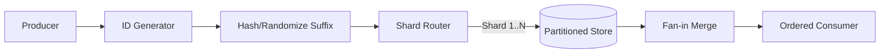

## Overview
Sortable IDs enable chronological feeds, event replay, and range scans, but naïvely ordering identifiers can concentrate traffic and inflate index maintenance. This guide explains how to preserve ordering guarantees while keeping shards balanced and storage efficient.

## What, Why, When (and when-not)
What
- Approaches for designing and operating time-ordered or sequence-based identifiers without overwhelming a handful of partitions.

Why
- Ordered IDs power feeds, retries, analytics windows, and consistent pagination. Without mitigation, they create hotspots that throttle throughput or trigger leader failover.

When
- Use when consumers need roughly chronological order, when range scans replace secondary indexes, or when compliance demands monotonic audit trails.

When-not
- Skip when workloads are purely key/value fetches with no ordering semantics, or when low-latency writes outweigh the need for temporal grouping.

## Core concepts and variants
- **Monotonic sequences**: Central sequence generators or database auto-increment provide strict global order at the cost of single-writer contention.
- **Timestamp-prefixed IDs (ULID/UUIDv7/Snowflake)**: Deliver lexicographic ordering with embedded randomness or worker IDs; expose a tunable balance between order and distribution.
- **Hybrid hash ordering**: Hashing a portion of ordered IDs (e.g., prefix) to determine shard while retaining suffix order per shard.
- **Segmented queues and lanes**: Separate ordered streams per tenant/partition to limit contention while preserving local order.
- **Logical clocks**: Provide partial ordering (Lamport/HLC) that captures causality more than wall time; useful when true time order is infeasible.

## Design decisions and trade-offs
- **Global vs per-partition order**: Global order simplifies compliance but forces coordination; per-shard order improves scale but may require merge logic downstream.
- **Hotspot mitigation**: Random least significant bits, hashed prefixes, or round-robin worker assignment flatten write distribution at cost of strict ordering granularity.
- **Read workload shape**: Range scans thrive with clustered order, but point lookups may prefer fully random IDs for cache dispersion.
- **Compaction and storage**: Ordered inserts lower B-tree fragmentation; however, sequential writes on single shard can exhaust autovacuum or log bandwidth.
- **Pagination semantics**: Choose stable cursors derived from ordered IDs; hashed prefixes complicate page boundaries unless combined with composite cursors.

## Algorithms/policies (conceptual)
- **Hashed-suffix Snowflake**
```pseudo
id = compose(timestamp_bits, region, worker, sequence)
hash = crc32(id) & 0xFF          # 256-way spread
shard = hash % NUM_SHARDS
store(shard, id)
```
- **Deterministic lane assignment**: Partition by tenant/category, maintain per-lane sequence to limit contention.
- **Sliding window compaction**: Enforce that timestamp suffix randomness spans ≥ 2^k buckets to keep shard load balanced at peak write QPS.

## Architecture and components
- ID generator exposes knobs (random bits, hash functions) and publishes configuration in service registry.
- Routing tier computes shard placement before hitting storage; optionally writes to dual index (ordered + hashed) for secondary access.
- Consumers maintain cursor checkpoints per shard and merge results client-side when strict global order isn’t provided.
- Analytics pipeline uses timestamp prefix for partitioning (e.g., parquet dir = `dt=YYYY-MM-DD`), while hashed suffix equalizes file sizes.

## Operational considerations
- Monitor per-shard write QPS, queue depth, and p99 latency to detect hotspots early.
- Track ID generator skew metrics (e.g., runs of identical prefixes) to catch clock regressions or misconfigured randomness.
- Alert on cursor lag across shards; merging logic should tolerate stragglers and late arrivals.
- Load test shard rebalancing with ordered IDs to ensure auto-scaling doesn't trigger sequential write storms.

## Examples
Example A (quantitative): Hotspot probability with random suffix
- If 10 random bits drive shard choice (1024 buckets) and workload emits 150k events/s, expected max bucket load ≈ λ + O(√(λ log n)) with λ≈146 events/s. Using 8 shards per bucket keeps per-shard p99 under 1.2k writes/s, within SSD limits.

Example B (architectural): Social feed ingestion
- Producer assigns ULIDs; gateway hashes low 80 bits to pick shard; storage keeps ordered index per shard. Feed service reads from 32 shards in parallel, merging by ULID timestamp to deliver near-real-time ordering with `<20` ms skew.

## Edge cases and anti-patterns
- Relying solely on timestamp bits for sharding leads to midnight stampedes when batch jobs trigger simultaneously.
- Combining range scans with hashed prefixes without secondary index breaks prefix queries; maintain dual indexes or composite keys.
- Ignoring clock rollback handling creates out-of-order IDs that violate monotonic cursors; add safeguards to pause issuance.

## Interactions with adjacent topics
- Consistency & CAP — Clocks and Ordering: ../05-consistency-and-cap/05-clocks-and-ordering.md
- Data Partitioning — Hotspot mitigation: ../03-data-partitioning/03-hotspot-mitigation.md
- Messaging & Streaming — Partition ordering trade-offs: ../07-messaging-and-streaming/02-topics-partitions-and-ordering.md

## Production checklist
- Define ordering requirement (global vs per-partition) and document fallback semantics.
- Configure randomness/hash bits to keep per-shard utilization within 20% of median.
- Implement cursor regeneration logic for pagination after re-sharding.
- Add dashboards for shard QPS skew, cursor lag, and generator health.

## Interview framing checklist
- Explain how to prevent hotspots when using time-ordered IDs.
- Discuss strategies for merging per-shard ordered streams into a global feed.
- Walk through impact of clock skew on ordered ID systems.

## References
- Twitter Snowflake design notes and follow-up posts on hotspot mitigation.
- Cloudflare blog on ULID/UUIDv7 ordering behavior.
- Google Spanner papers on TrueTime and timestamp ordering.

## Diagram

