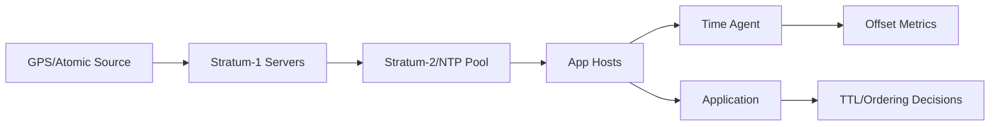

## Overview
Distributed systems rely on imperfect clocks. Wall clocks drift, monotonic counters jump, and synchronization is never exact. Designing with explicit skew budgets keeps ordering, TTLs, and SLAs safe even when time misbehaves.

## What, Why, When (and when-not)
What
- Definition of wall, monotonic, logical, and hybrid clocks; how skew manifests; how to budget and monitor time accuracy.

Why
- Time determines ordering, expiry, billing windows, and audit logs. Skew causes missed deadlines, negative latencies, and data loss in TTL-driven stores.

When
- Essential when issuing time-ordered IDs, enforcing expirations, reconciling multi-region writes, or computing SLAs from timestamps.

When-not
- Non-distributed prototypes or purely event-driven systems using relative timers may defer detailed time budgets.

## Core concepts and variants
- **Wall clock (UTC)**: human-facing time; subject to adjustments (NTP step, leap seconds). Provides shared reference but not monotonic.
- **Monotonic clock**: steady counter unaffected by wall adjustments; ideal for measuring intervals but lacks absolute meaning.
- **Clock skew**: difference between clocks at same real time; measured as offset (bias) and drift (rate error).
- **Clock synchronization**: NTP (packet exchange), PTP (hardware-assisted), GPS, atomic references. Each has accuracy ranges (ms to sub-µs).
- **Leap second handling**: smear vs step. Systems must agree or risk ordering glitches.
- **Skew budget**: tolerated max divergence between nodes before correctness breaks (e.g., ±2 ms for Spanner TrueTime).

## Design decisions and trade-offs
- **Accuracy vs cost**: PTP + hardware timestamping yields µs accuracy but costs more; NTP fits most workloads with tolerant budgets.
- **Monotonic fallback**: Use monotonic clock for durations, wall clock for user-facing times; mixing them causes negative latencies.
- **Skew detection**: Compare with reference (Chrony, GPS); choose alarms thresholds that trigger safe-mode (pause IDs, extend TTLs).
- **Time source redundancy**: Multiple upstream NTP servers reduce correlated failure but may increase jitter; prefer tiered hierarchy.
- **Leap seconds**: Smearing across minutes vs immediate step influences ID ordering; align with cloud provider policy to avoid mismatches.

## Algorithms/policies (conceptual)
- **Skew budget definition**
```pseudo
max_write_drift = ttl_safety_margin / 2
if abs(local_offset) > max_write_drift:
  pause_mutations()
  raise_alert()
```
- **Monotonic timestamp generation**
```pseudo
last = 0
function now_monotonic():
  candidate = wall_clock()
  if candidate < last:
    candidate = last  # clamp
  last = candidate
  return candidate
```

## Architecture and components
- Time synchronization tier: stratum servers (Chrony, GPS, cloud), distributing clock to hosts.
- Host agents: monitor clock offset, write to metrics; integrate with config mgmt to adjust.
- Application time adapter: library offering `now_wall`, `now_monotonic`, `deadline_from_now`, applying skew budgets.
- Observability: dashboards chart offsets, jitter, leap adjustments, and error budgets.

## Operational considerations
- Track `chronyc tracking` or equivalent to observe offset/drift; alarm when exceeding SLA (e.g., ±5 ms).
- Stagger NTP server updates; rolling restarts avoid simultaneous resync spikes.
- During leap events, verify smear policy; coordinate with cloud-managed instances.
- Log both wall timestamp and monotonic delta for critical events to ease post-mortem timeline reconciliation.

## Examples
Example A (quantitative): TTL safety margin
- A cache with TTL=5 minutes and acceptable stale window=30 s allocates ±15 s skew budget. If offset hits 25 s, extend TTL by 10 s or pause deletes to avoid premature eviction.

Example B (architectural): TrueTime-inspired clock
- Regional time masters sync via GPS; each node exposes `[earliest, latest]` bound with uncertainty ε. Transactions only commit when `now().latest < deadline`. Applications compare intervals rather than relying on single timestamp.

## Edge cases and anti-patterns
- Relying on wall clock for timeout calculations causes negative durations when clock steps back.
- Allowing writes during large skew leads to out-of-order IDs or expired data revival.
- Running NTP with default polling on VMs with jitter causes 100+ ms swings; tune polling intervals and sourcing.

## Interactions with adjacent topics
- Consistency & CAP — Clocks and Ordering: ../05-consistency-and-cap/05-clocks-and-ordering.md
- Availability & Fault Tolerance — Failover and fencing: ../09-availability-and-fault-tolerance/06-failover-promotion-and-dr.md

## Production checklist
- Define and document skew budget with owners.
- Monitor offsets on dashboards; set paging thresholds.
- Use monotonic clocks for durations and deadline math.
- Verify leap-second policy in lower environments before global events.

## Interview framing checklist
- Explain why monotonic and wall clocks differ and when to use each.
- Describe how you’d detect and react to 100 ms skew in a payment system.
- Discuss leap second handling strategies and trade-offs.

## References
- Google Spanner and TrueTime paper.
- Chrony and NTP best-practice guides.
- AWS, Google Cloud documentation on leap-second smearing.

## Diagram

