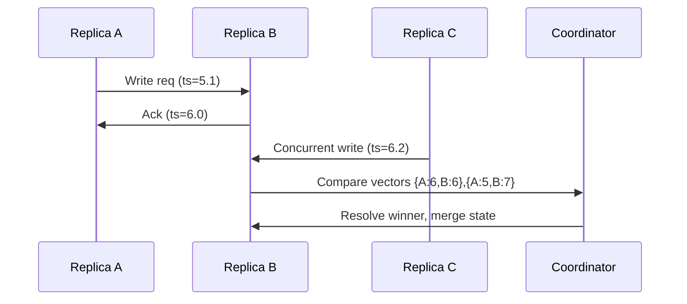

## Overview
Logical clocks let systems order events consistently when wall time is unreliable. They capture causal relationships and provide deterministic resolution for concurrent updates across replicas.

## What, Why, When (and when-not)
What
- Techniques for deriving event order from message flows: Lamport clocks, vector clocks, hybrid logical clocks (HLC), and dotted/version vectors.

Why
- Needed for conflict-free replication, idempotent retries, deduplicating messages, or merging CRDT states where time-of-day is insufficient or misleading.

When
- Distributed writes with last-writer-wins semantics, replicated logs that must preserve causality, or audit trails where wall clock divergence is unacceptable.

When-not
- Single-writer systems or strongly consistent databases where serializable transactions already provide ordering guarantees.

## Core concepts and variants
- **Lamport clock**: single integer per node; increments on local events and message receipt; establishes partial order (happens-before) but not concurrency detection.
- **Vector clock**: per-node counter vector; detects concurrency when two vectors are incomparable.
- **Version vectors/dotted vectors**: compact vector variants using per-node counters and tombstones to track removals.
- **Hybrid logical clock (HLC)**: combines wall time with logical counter to bound skew while providing total order consistent with real time.
- **Logical timestamp metadata**: included in messages, writes, or metadata columns (e.g., `lcounter`, `vclock`)

## Design decisions and trade-offs
- **Metadata size**: Vector clocks grow with number of replicas; use bounded replication sets or dotted variants for large clusters.
- **Conflict resolution**: Choose LWW (with HLC), merge semantics (CRDTs), or app-specific policies using vector dominance.
- **Storage format**: Encode vectors as maps, sorted arrays, or compressed bitsets; ensure deterministic serialization for hashing.
- **Clock source**: HLC reduces reliance on perfectly synchronized wall clocks but requires handling of counter overflow and monotonicity.
- **Performance**: Updating vectors adds CPU/memory overhead; weigh accuracy needs vs cost.

## Algorithms/policies (conceptual)
- **Lamport clock update**
```pseudo
state.counter += 1              # on local event
send(message, state.counter)

on_receive(message, incoming):
  state.counter = max(state.counter, incoming) + 1
```
- **Hybrid logical clock**
```pseudo
function hlc_now():
  wall = current_wall_ms()
  if wall > state.physical:
    state.physical = wall
    state.logical = 0
  else:
    state.logical += 1
  return (state.physical, state.logical)

function hlc_update(remote):
  state.physical = max(state.physical, remote.physical)
  if state.physical == remote.physical:
    state.logical = max(state.logical, remote.logical) + 1
  else:
    state.logical = 0
```

## Architecture and components
- Each replica maintains logical clock state; messaging layer injects timestamps into envelopes.
- Storage embeds clocks in row version columns for conflict detection.
- Conflict resolution services (e.g., Dynamo-style coordinators) compare clocks to pick winners or trigger reconciliation flows.
- Observability includes metrics for logical counter growth and number of concurrent conflicts detected.

## Operational considerations
- Monitor size of vectors; prune entries for offline replicas after retention window.
- Set thresholds on logical counter growth—rapid increase indicates stalled wall clock or message delay.
- Ensure serialization/deserialization compatibility across language stacks to avoid ordering bugs.
- Include logical timestamp in logs to aid incident reconstruction when wall time is skewed.

## Examples
Example A (quantitative): Vector clock storage cost
- With 6 replicas and 8-byte counters, vector metadata is 48 bytes per update. For 1B updates/year, storing vectors inline adds ~48 GB/year; compressing sparse vectors can halve this if typical concurrency involves ≤3 replicas.

Example B (architectural): Multi-master key-value store
- Each replica issues HLC timestamps for writes. Coordinators compare timestamps; higher (physical, logical) wins. Ties trigger merge function for CRDT data types. Read repair propagates newer timestamps to lagging replicas.

## Edge cases and anti-patterns
- Resetting logical clock on node restart without persisting state can regress timestamps; persist or seed from storage.
- Dropping vector entries for slow replicas too early leads to missed conflict detection; align pruning with replication lag SLA.
- Mixing wall-clock-based LWW with vector-clock-based resolution introduces contradictions; stick to one policy.

## Interactions with adjacent topics
- Consistency & CAP — Conflict resolution: ../05-consistency-and-cap/04-session-guarantees-and-client-techniques.md
- Replication — Quorum reconciliation: ../04-replication/02-quorums-and-consensus.md

## Production checklist
- Persist logical clock state across restarts.
- Expose metrics for clock drift and logical counter growth.
- Document conflict resolution hierarchy (clock dominance vs merge).
- Provide tooling to inspect and compare logical timestamps during incidents.

## Interview framing checklist
- Explain why Lamport clocks establish partial order and where they fall short.
- Describe how HLC helps with last-writer-wins under clock skew.
- Walk through resolving concurrent writes with vector clocks.

## References
- Leslie Lamport’s “Time, Clocks, and the Ordering of Events in a Distributed System.”
- Dynamo and Riak papers on vector clocks.
- Hybrid Logical Clock research and CockroachDB documentation.

## Diagram

