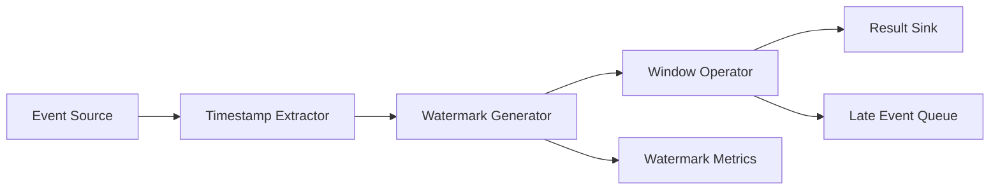

## Overview
Streaming systems juggle event-time semantics (when data occurred) and processing-time realities (when it was observed). Watermarks estimate completeness and allow bounded-latency aggregations while tolerating late data.

## What, Why, When (and when-not)
What
- Concepts of event time, processing time, ingestion time, and watermarks; techniques to manage late/out-of-order events in pipelines.

Why
- Accurate analytics, billing, and alerting depend on event-time correctness. Processing-time triggers alone skew metrics during delays or bursts.

When
- Required for windowed aggregations, stream analytics, real-time ML features, and streaming ETL where lateness is common.

When-not
- Simple log tails or ETL where exact time alignment is unnecessary and idempotent bulk reprocessing suffices.

## Core concepts and variants
- **Event time**: Timestamp embedded in record payload; reflects real-world occurrence.
- **Processing time**: System clock when record is processed; influenced by lag, skew, backpressure.
- **Watermark**: System’s assertion that no events earlier than a time threshold are expected (up to allowed lateness).
- **Allowed lateness**: Grace period to accept late events before finalizing window results.
- **Window types**: Tumbling, sliding, session windows; each interacts differently with lateness.
- **Triggering**: When to emit partial/final results (after watermark, repeated at intervals, on count).

## Design decisions and trade-offs
- **Watermark computation**: Source-based (Kafka partition timestamp) vs operator-based heuristics; inaccurate watermarks either delay results or trigger retractions.
- **Lateness tolerance**: Larger grace handles long-tail delays but increases state retention and memory use.
- **Backfill strategy**: Decide whether late data triggers retractions (update results) or is logged separately.
- **Clock source**: Event timestamp extraction must guard against malformed or missing values.
- **Multi-partition alignment**: Watermark typically min across partitions; slow partitions throttle pipeline.

## Algorithms/policies (conceptual)
- **Watermark propagation**
```pseudo
wm = min(partition_event_time) - max_lateness
if wm > last_emitted:
  emit_watermark(wm)
  last_emitted = wm
```
- **Late data handling**
```pseudo
if event_time < watermark:
  if event_time > watermark - allowed_lateness:
    update_window(event)
  else:
    route_to_dead_letter(event)
```

## Architecture and components
- Sources (Kafka, Kinesis) assign initial event timestamps and source watermarks.
- Stream processors (Flink, Beam, Spark Structured Streaming) combine watermarks, manage window state, and emit results.
- Storage sinks (Delta Lake, BigQuery) handle updates/upserts for late-arriving corrections.
- Monitoring dashboards display watermark lag, window backlog, and late event rates.

## Operational considerations
- Track watermark progression vs wall time; stalled watermark indicates partition lag or clock issues.
- Measure late-event percentage; adjust allowed lateness or upstream buffering accordingly.
- Ensure state TTL matches lateness to avoid evicting window state prematurely.
- Reconcile with batch reprocessing strategy to correct extreme lateness or outages.

## Examples
Example A (quantitative): Choosing lateness budget
- If 95% of events arrive within 2 minutes, 99.9% within 15 minutes, set allowed lateness to 15 minutes to bound correction rate while keeping state manageable. Expect ~0.1% of events routed to DLQ.

Example B (architectural): Fraud detection stream
- Events carry event time from card swipers. Flink job uses per-merchant sessions with 10-minute allowed lateness. Watermark derived from Kafka partition offsets minus 5 minutes. Late updates re-trigger scoring; beyond 10 minutes, events land in manual review queue.

## Edge cases and anti-patterns
- Using processing time windows for user-facing metrics causes spikes whenever backpressure occurs.
- Setting watermark directly to latest event time without subtracting lateness ignores slow partitions and drops valid events.
- Forgetting to persist state across restarts loses partial windows; configure checkpointing.

## Interactions with adjacent topics
- Messaging & Streaming — Consumer groups and ordering: ../07-messaging-and-streaming/03-pubsub-consumer-groups-and-scaling.md
- Observability — Metrics histograms: ../11-observability/02-metrics-histograms-and-cardinality.md

## Production checklist
- Define allowed lateness and communicate to stakeholders.
- Implement DLQ or audit log for events exceeding lateness budget.
- Alert on watermark lag exceeding SLA and high late-event ratio.
- Validate event timestamp extraction in staging to avoid null/malformed values.

## Interview framing checklist
- Explain difference between event time and processing time.
- Describe how watermarks work and how to set allowed lateness.
- Discuss handling extremely late or out-of-order events.

## References
- Google Cloud Dataflow whitepaper on event-time processing.
- Flink documentation on watermarks and triggers.
- Kafka Streams and Beam best practices for late data.

## Diagram

