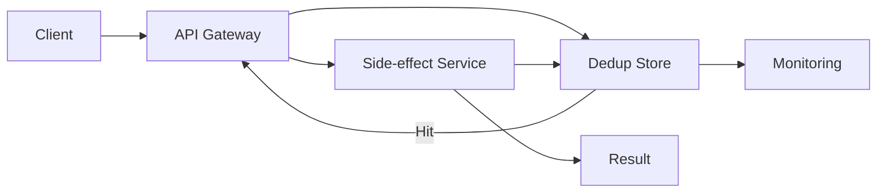

## Overview
Retries and eventual consistency demand idempotent semantics. Combining idempotency keys, dedup stores, and thoughtful TTLs prevents duplicate side effects when networks misbehave.

## What, Why, When (and when-not)
What
- Techniques to ensure repeated requests or messages do not create duplicate effects. Covers idempotency keys, dedup caches, TTL sizing, and replay protection.

Why
- Network retries, at-least-once delivery, and client reconnects are inevitable. Without safeguards, they produce duplicate charges, double writes, or inconsistent state.

When
- Payment APIs, order placement, workflow orchestration, event processing, and any distributed write path.

When-not
- Purely read-only interactions or internal systems with exactly-once semantics guaranteed by infrastructure (rare).

## Core concepts and variants
- **Idempotency key**: Client-supplied identifier that uniquely represents intended operation; server stores outcome keyed by this ID.
- **Dedup store**: Cache or database table storing processed keys with TTL; can hold payload hash and result.
- **Replay window**: Time horizon over which duplicates may arrive; defines TTL for dedup entries.
- **Operation semantics**: Idempotent mutation returns same result for same key; non-idempotent operations must be wrapped or transformed.
- **TTL strategies**: Fixed duration, adaptive (based on business cycles), or tiered by operation type.
- **Stateful vs stateless**: Stateless approach pushes dedup to client; stateful server caches processed keys.

## Design decisions and trade-offs
- **Storage choice**: Redis/memory for low-latency but limited persistence; durable DB ensures recovery but adds latency.
- **TTL length**: Longer TTL reduces duplicate risk but consumes storage; align with maximum retry window plus clock skew margin.
- **Payload hashing**: Storing hash ensures replay matches original payload; prevents key reuse with different data.
- **Concurrency**: Use atomic upsert (e.g., `SETNX`, compare-and-set) to avoid race conditions; include status transitions (pending -> success -> expired).
- **Partial failures**: Define compensating transactions when dedup store commit fails after side effect applied.

## Algorithms/policies (conceptual)
- **Idempotency flow**
```pseudo
key = request.idempotency_key
if dedup.exists(key):
  return dedup.get_result(key)

result = perform_side_effect()
dedup.store(key, hash(request), result, ttl)
return result
```
- **TTL sizing**
```pseudo
ttl = max_client_retry_window + network_buffer + skew_margin
```
- **Cleanup policy**: Background job scans expired keys, ensuring storage reclaimed without blocking main path.

## Architecture and components
- Client libraries generate deterministic idempotency keys (e.g., order ID + stage).
- API gateway validates key presence, enforces TTL policies, and attaches dedup metadata.
- Dedup store (Redis cluster, DynamoDB table) records key, payload hash, status, expiry.
- Observability pipeline tracks duplicate attempts, TTL distribution, and storage saturation.

## Operational considerations
- Monitor dedup hit rate; spikes may indicate buggy clients or retry storms.
- Track storage utilization vs TTL; autoscale or shard dedup store before saturation.
- Log mismatched payload hashes to detect malicious or buggy replay attempts.
- Provide tooling for support to query idempotency key status and reprocess safely.

## Examples
Example A (quantitative): Sizing dedup store
- For 200k requests/min with 7-day TTL, storing 64-byte key + 32-byte hash + 32-byte result pointer ≈ 128 bytes/entry. Total storage ≈ 200k * 60 * 24 * 7 * 128 ≈ 154 GB; plan sharding or shorter TTL with archival.

Example B (architectural): Payment API
- Client sends `Idempotency-Key` header. API gateway checks Redis; on miss, forwards to payment processor. Once charge succeeds, result stored with 24-hour TTL (covers client retries + bank resubmits). Subsequent retries return stored response instantly.

## Edge cases and anti-patterns
- Allowing clients to omit idempotency key for critical operations leads to duplicates; enforce mandatory keys.
- Reusing same key across different operations without payload hash check causes false dedup hits.
- TTL shorter than client retry policy allows duplicates after expiry; align policies across teams.

## Interactions with adjacent topics
- Rate Limiting & Backpressure — Retries and client behavior: ../08-rate-limiting-and-backpressure/05-retries-idempotency-and-client-behavior.md
- Availability — Failover and fencing: ../09-availability-and-fault-tolerance/06-failover-promotion-and-dr.md

## Production checklist
- Document idempotency key format and client contracts.
- Implement atomic insert in dedup store with payload hash validation.
- Set TTL ≥ maximum retry window + skew.
- Add dashboards for dedup hits, misses, storage utilization, and mismatched payloads.

## Interview framing checklist
- Describe how to make a payment endpoint idempotent.
- Explain how to size dedup storage for a given throughput and TTL.
- Discuss handling of partial failures when dedup recording fails.

## References
- Stripe engineering blog on idempotent APIs.
- AWS architecture guides on dedup in distributed systems.
- Google SRE workbook on handling retries and idempotency.

## Diagram

