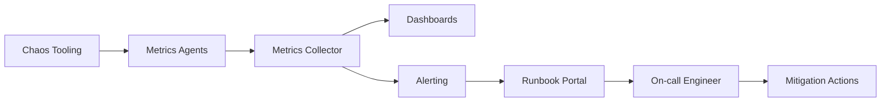

## Overview
ID and time infrastructure underpin the entire platform. Observability must expose collision risk, hotspot formation, clock health, and issuance latency. Runbooks guide incident response when randomness fails or clocks misbehave.

## What, Why, When (and when-not)
What
- Operational patterns to observe ID generators, dedup stores, and time synchronization systems. Includes metrics, alerts, on-call runbooks, and chaos drills.

Why
- Failures manifest as data corruption, billing errors, and outages. Early detection prevents duplicate IDs, stale TTLs, or inconsistent ordering.

When
- Continuous monitoring in production; runbooks activated during alerts or scheduled game days.

When-not
- Not needed for throwaway prototypes but invest early before scaling to multi-region traffic.

## Core concepts and variants
- **Health signals**: issuance latency, collision rate, shard skew, clock offset, dedup hit rate, TTL expiry mismatches.
- **Tracing**: propagate ID metadata through distributed traces to spot hotspots and ordering anomalies.
- **Chaos exercises**: simulate clock skew, NTP outage, RNG failure, or dedup store saturation.
- **Runbook structure**: detection, immediate mitigation, root-cause investigation, post-incident tasks.
- **Automation**: auto-disable ID issuance on skew breach; escalate to on-call.

## Design decisions and trade-offs
- **Sampling vs full coverage**: full collision checks are expensive; sample subsets and supplement with statistical alarms.
- **Centralized logging**: storing raw IDs aids forensics but may expose sensitive metadata; apply access controls.
- **Alert thresholds**: false positives exhaust on-call; tune thresholds around SLA budgets with historical data.
- **Mitigation actions**: automatic stalling protects data but reduces availability; balance speed vs business impact.

## Algorithms/policies (conceptual)
- **Collision monitoring**
```pseudo
window = rolling_hour()
collisions = count_duplicates(ids_emitted(window))
if collisions > budget:
  page_oncall()
  initiate_rollover()
```
- **Skew guard**
```pseudo
if abs(clock_offset) > skew_budget:
  set_flag("pause_id_service")
  reroute_to_backup_region()
```

## Architecture and components
- Metrics pipeline collects ID issuance stats and clock offsets from agents.
- Alerting system integrates with paging (PagerDuty, Opsgenie).
- Runbook repository documents procedures, linked from alerts.
- Chaos tooling (e.g., `tc`, fault injection) tests resilience of ID and time components.

## Operational considerations
- Maintain dashboards summarizing per-shard QPS, collision counts, RNG entropy, clock offsets, and dedup store saturation.
- Schedule quarterly game days injecting 50 ms skew or RNG failure to validate response.
- Keep emergency fallback (secondary ID generator or manual issuance) documented and tested.
- Version runbooks and record MTTR improvements after each incident.

## Examples
Example A (quantitative): Alert threshold tuning
- If normal shard skew stays within ±12%, set warning at 20% and critical at 35%. With 40 shards at 5k rps each, critical alert triggers when any shard exceeds 6.75k rps sustained for 5 minutes.

Example B (architectural): Time skew incident response
- Monitoring detects offset >50 ms in region A; automation pauses Snowflake issuance, shifts traffic to region B’s generator, notifies on-call. Runbook instructs verifying Chrony status, restarting faulty stratum server, and confirming offset recovery before re-enabling region A.

## Edge cases and anti-patterns
- Silence alerts during maintenance without compensating monitors leads to blind spots.
- Failing to log mitigation commands hampers audits; ensure actions recorded in incident timeline.
- Relying solely on synthetic tests without real workload chaos hides compound failures.

## Interactions with adjacent topics
- Availability & Fault Tolerance — Failover and DR: ../09-availability-and-fault-tolerance/06-failover-promotion-and-dr.md
- Observability — Alerting and runbooks: ../11-observability/07-alerting-dashboards-and-runbooks.md

## Production checklist
- Instrument key metrics (latency, collisions, skew, dedup hits, TTL drift).
- Create runbooks with clear mitigation steps and escalation paths.
- Automate guardrails to pause ID issuance on severe skew.
- Conduct periodic chaos drills covering ID/time failures.

## Interview framing checklist
- Describe metrics and alerts for an ID generation service.
- Walk through responding to a clock skew incident.
- Explain how to rehearse dedup store saturation scenarios.

## References
- AWS Builders Library on shuffle-sharding and fault isolation.
- Google SRE workbook on incident response.
- Cloudflare posts on monitoring UUID/ULID quality.

## Diagram

