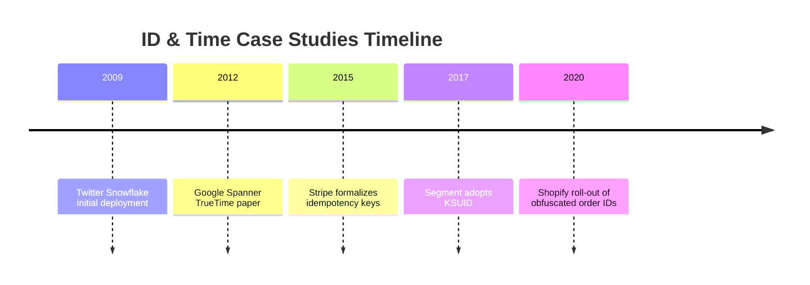

## Overview
Case studies illustrate how leading platforms solved identity and time challenges. Learn from their design choices, migrations, and operational practices to avoid repeating history.

## What, Why, When (and when-not)
What
- Real implementations of ID and time strategies, highlighting drivers, trade-offs, and incident learnings.

Why
- Concrete examples help teams justify decisions and anticipate pitfalls during architecture reviews.

When
- Use during design reviews, onboarding, or retrospectives when evaluating similar workloads.

When-not
- Do not copy blindly; adapt lessons to your scale, compliance, and staffing realities.

## Core concepts and variants
- **Stripe Idempotency & Keys**: Payments rely on idempotency keys with 24h TTL; dedup store ensures safe retries.
- **Twitter Snowflake Evolution**: Migrated from sequential IDs to Snowflake to scale tweet creation while preserving order.
- **Google Spanner TrueTime**: GPS/PTP-based bounded uncertainty model enabling globally consistent timestamps.
- **Segment KSUID adoption**: Swapped UUIDv4 for KSUID to support chronological ordering in logs and analytics.
- **Shopify order IDs**: Combined Base32 encoding with hash prefixes for storefront readability and anti-enumeration.

## Design decisions and trade-offs
- Balance between deterministic order and sharding; use hashed suffixes or multi-lane sequences.
- TTL length aligned with business SLA (chargebacks, compliance) vs storage cost.
- Operational overhead of maintaining precise time vs risk of stale data.
- Exposure of IDs to users demands readability and anti-enumeration measures.

## Case study 1: Stripe Payments
- **Problem**: Duplicate charges due to network retries.
- **Approach**: Required `Idempotency-Key` per request, stored outcome in Redis + durable log (Kafka) with 24h TTL.
- **Results**: Eliminated duplicate charges; observability dashboards show dedup hit rate and TTL usage.
- **Lessons**: Keys must include payload hash to prevent misuse; TTL aligned with card network retry policy.

## Case study 2: Twitter Snowflake
- **Problem**: Global tweet volume exceeded central DB sequence throughput.
- **Approach**: Introduced 64-bit Snowflake IDs (41-bit timestamp, 10-bit worker, 12-bit sequence). Added worker registry with ZooKeeper and hashed routing to avoid hotspots.
- **Results**: Achieved 6k+ tweets/ms capacity. Operational playbooks handle clock skew by fencing misbehaving workers.
- **Lessons**: Worker ID leasing and clock guardrails essential; favorites/retweets rely on roughly ordered IDs for timeline ranking.

## Case study 3: Google Spanner TrueTime
- **Problem**: Need globally consistent timestamps for distributed transactions.
- **Approach**: Deploy atomic clocks + GPS; exposes `[earliest, latest]` bounds with uncertainty ε. Transactions wait out uncertainty to guarantee external consistency.
- **Results**: Enables serializable multi-region transactions; SLA demands ε < 7 ms.
- **Lessons**: Significant operational investment; fallback to less precise time increases commit latency.

## Case study 4: Segment KSUID
- **Problem**: UUIDv4 hindered chronological analysis of events.
- **Approach**: Adopted KSUID (32-bit timestamp + 128-bit random); Base62 encoding for readability, storing binary internally.
- **Results**: Natural ordering improved analytics pipelines; hashed suffix mitigated shard hotspots.
- **Lessons**: Provided migration plan with dual IDs; validated randomness to maintain uniqueness.

## Case study 5: Shopify Order IDs
- **Problem**: Sequential order numbers vulnerable to enumeration and lacked info at a glance.
- **Approach**: Introduced Base32 IDs with embedded shop prefix and hash to obfuscate increments while keeping readability.
- **Results**: Reduced scraping risk; support tooling decodes metadata for operations.
- **Lessons**: Documented decoding tools and trained support; ensured hash doesn’t leak order volume.

## Edge cases and anti-patterns
- Ignoring worker ID fencing led to duplicate IDs during network partition (documented in early Snowflake incidents).
- TTL mismatch caused Stripe-like systems to accept duplicate charges after TTL expiry; addressed with longer TTL + alerts.
- Inadequate time monitoring led to stale data replication in multi-region retail platform; recovery required manual reconciliation.

## Interactions with adjacent topics
- Rate Limiting — Retry semantics: ../08-rate-limiting-and-backpressure/05-retries-idempotency-and-client-behavior.md
- Observability — Incident post-mortems: ../11-observability/07-alerting-dashboards-and-runbooks.md

## Production checklist
- Benchmark your workload against similar case study metrics.
- Incorporate lessons learned into internal runbooks and design templates.
- Validate migration plans with dual-write strategies inspired by case studies.

## Interview framing checklist
- Discuss Snowflake design and how you’d handle clock skew.
- Explain idempotency key storage inspired by Stripe and how to size TTLs.
- Outline how TrueTime guarantees serializability and its operational cost.

## References
- Twitter engineering blog: “Announcing Snowflake.”
- Stripe engineering on idempotency keys.
- Google Spanner paper (SIGMOD 2012).
- Segment blog on KSUID adoption.
- Shopify engineering articles on order identifiers.

## Diagram

