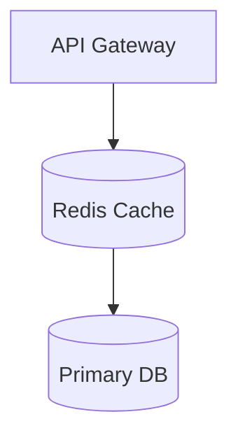

# Tech Documentation Skill

## When to use
- Draft or expand system-design documentation (Docusaurus Markdown/MDX) inside `/docs`.
- Refine tone, structure, or consistency of existing technical docs.
- Build supporting diagrams or worked examples that accompany the docs.

## Preparation
1. Check for applicable `AGENTS.md` files in target directories before editing.
2. Review `memory-bank/docsAuthoringStandards.md` for canonical fundamentals structure and style; keep it open for cross-reference.
3. Skim adjacent docs within the same folder to match heading conventions, front-matter, and numbering.

## Authoring workflow
1. **Clarify scope**: summarize the topic, target audience, and deliverables (new page, section update, checklist, etc.). Note citation requirements.
2. **Collect references**: gather primary sources (internal docs, reputable engineering blogs, standards). Log key data points and URLs for attribution.
3. **Outline first**: follow the canonical ordering from the authoring standards (Overview → What/Why/When → Core Concepts → Trade-offs → Operations → Examples → Edge Cases → Interactions → Production Checklist → Interview Checklist → References). For non-fundamental pages, adapt headings to existing patterns.
4. **Work examples**: prepare at least one quantitative and one architectural example. Use realistic workloads (SaaS tenants, e-commerce orders, social feeds, IoT telemetry).
5. **Diagram prep**: plan 1–2 Mermaid diagrams when they materially clarify flows or topology. Keep node labels short and readable.
6. **Write in passes**:
   - Pass 1: fill each outline section with concise, declarative paragraphs. Define terms before use.
   - Pass 2: add callouts (tables, pseudocode snippets ≤30 lines, checklists) and ensure numbering relies on site CSS (no manual numbering in headings).
   - Pass 3: tighten language, unify terminology, double-check cross-links (`[Label](/docs/…)`).
7. **Review**: verify acceptance checklist from `docsAuthoringStandards.md`:
   - Covers What/Why/When, variants, trade-offs, operations.
   - Includes ≥2 worked examples and relevant diagrams.
   - Provides production and interview checklists.
   - References authoritative sources.
8. **Validation**: run Prettier if configured (`npm run lint:docs` or repo-specific script). Ensure MD/MDX compiles locally if practical.
9. **Summary**: document key changes, assumptions, and follow-up items in the final response.

## Diagram quick reference
```

```

## Style checklist
- Use U.S. English, active voice, present tense.
- Keep paragraphs ≤4 sentences; use bullet lists for dense comparisons.
- Avoid marketing language; focus on verifiable engineering facts.
- Maintain consistent casing (Title Case for headings, Sentence case elsewhere).
- Cite stats and claims with reliable references; avoid placeholder text.

## Outputs
- Updated Markdown/MDX files in-place within `/docs`.
- Optional assets (PNGs/SVGs) stored under `static/img` following existing naming.
- Final assistant summary covering scope, changes, open questions, and test/validation results.
